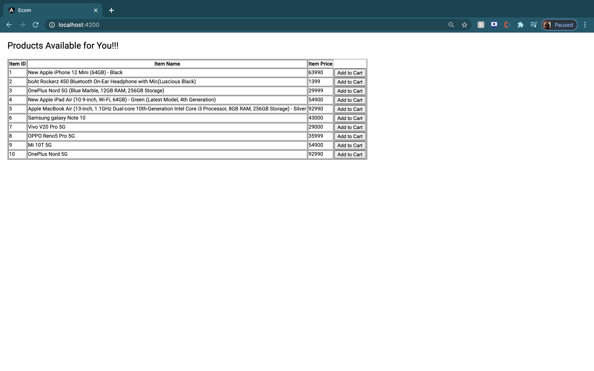
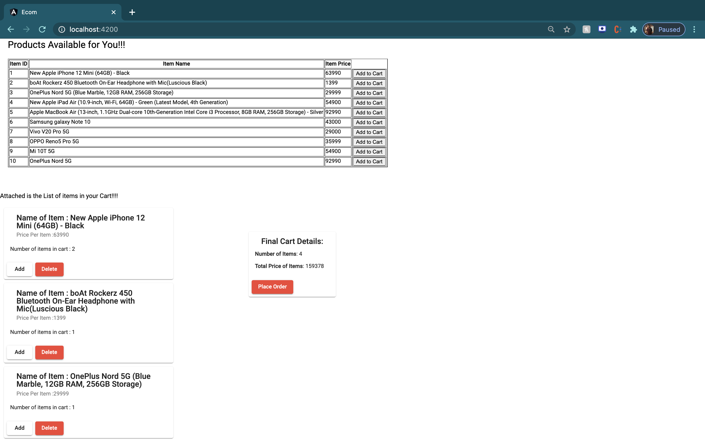
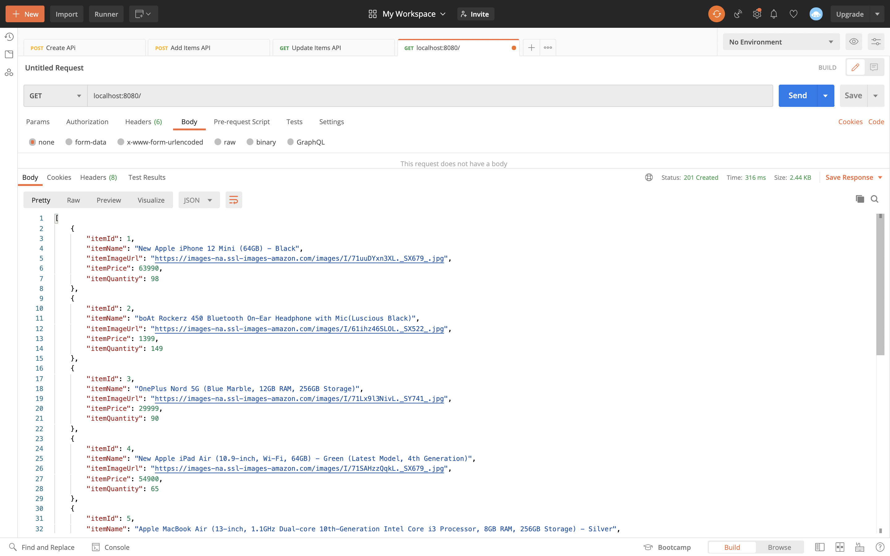
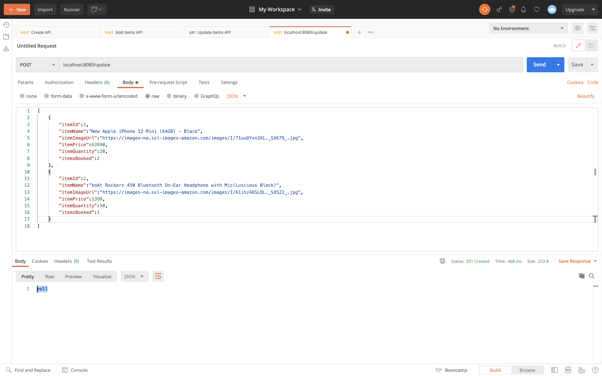
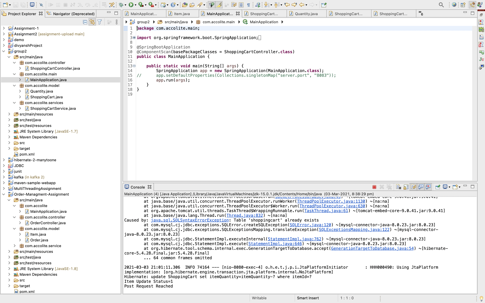

# Realtime WebApp Development(Group2)

- The frontend is done using angular. It can be found inside the frontend folder.
- The backend is done using spring mvc and spring hibernate. The database management is done using mySQL database.

# Frontend

1. cd into the frontend folder.

2. Install the node_modules using the command - 

```
npm install
```

3. To run the application, use the command - 

```
ng serve -o
```

# Backend

1. cd into the sample-project folder using the command - 

``` 
cd sample-project

```

2. Run the command to automatically install the project's main artifact (the JAR, WAR or EAR), its POM and any attached artifacts (sources, javadoc, etc) produced -

```
mvn install

```

3. Run the MainApplication.java file by right clicking on the project file and selecting Run As -> Java Application. The java application will run on localhost:8080.

4. There are two APIs - 

 - GET Request - localhost:8080/ - to fetch the details of all the products.
 
 - POST Request - localhost:8080/update - to update the quantity of the products with the given productId.
 
5. Website Screenshots - 

<div>
    
    
</div>

Postman Screenshots

<div>
    
    
    
</div>

- Here the 'update status 1' shows that the item has been sucessfully updated in the database.

